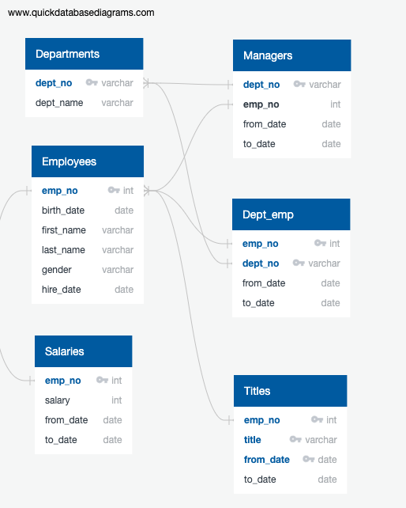
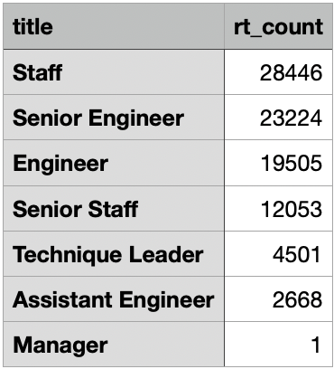

# Pewlett-Hackard-Analysis
## Challenge Overview
After creating multiple analysis for Bobby, he wants us to create two more technical analysis. The first one is creating new tables showing the number of retiring employees by title. The second analysis is creating a table containing employees who are eligible for the mentorship program.

## Analysis:
To start the analysis I created an ERD (Table 1) in order to map out the existing databases. This allowed for a more organized and efficent workflow.

Table 1

For our first deliverable to Bobby, I create a CSV file containing all of the employees who are retiring and their most recent title. After condensing this into a readable title we can see that out of the 90,398 people who are retiring from Pewlett-Hackard, the most come from the staff, who have 28,446 employees retiring. Overall there is 7 different titles that have employees retiring. Table 2 below provides us of the breakdown of the amount of retirements that will be occuring in the different job titles. 

Table 2

For the second deliverable we created a CSV file called mentor_elig, which is a list of all the employees eligible for the mentorship program. To do further analysis I create an overview of the total number of employees in each title that are eligible to become mentors. As we see from table 3 below Senior Staff has the most employees eligible for the program with 569 and Assistant Engineers have the least with only 29 employees eligible for the mentorship program. In total there are 1,549 eligible employees for the program. 

Table 3

## Additional Suggested Analysis
An additional analysis that should be looked into is the amount of employees needed for each job title. This would allow us to figure out how many employees to hire after the employees in our "recent_title_retire.csv" retire. 

